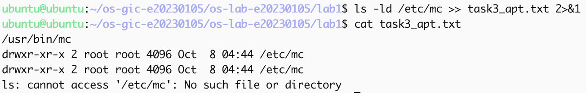
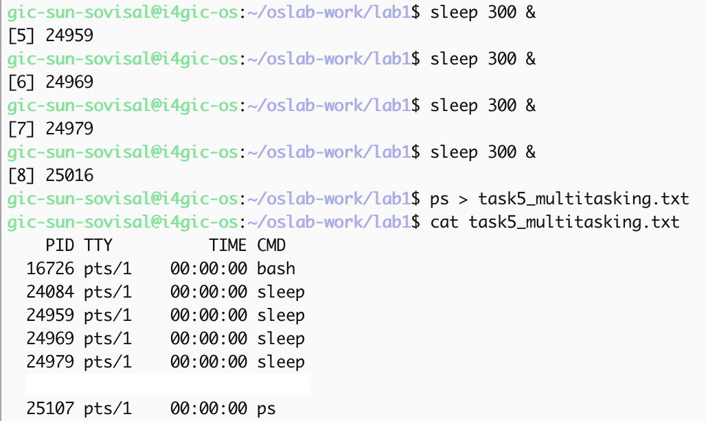
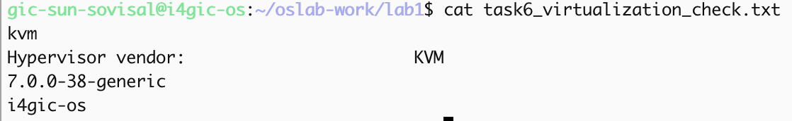

# OS Lab 1 Submission

Copy this template to `os-lab-YOUR_ID/lab1/README.md` in your own repository. Follow [the instructions](lab1-instruction.md). Your prediction and checkpoint answers are already saved by `oslab`; do not copy them here.

- **Student Name: SUN SOVISAL**
- **Student ID: e20230105**
- **Ubuntu username on the server: gic-sun-sovisal**
- **My values** (`oslab values lab1`): file1 = river, file2 = stone, count = 4

---

## Task 1: Operating System Identification

Briefly describe what you observed about your OS and kernel. Which number is the kernel version, and which is the distribution version?

The server host is `i4gic-os`. `uname -a` gave kernel `7.0.0-38-generic`. `lsb_release -a` gave Ubuntu 26.04.1 LTS, release 26.04, codename resolute. The kernel version is `7.0.0-38-generic`. The distribution version is 26.04.

<!-- You may show the contents of task1_os_info.txt here; no screenshot needed. -->

---

## Task 2: Essential Linux File and Directory Commands

Briefly describe your experience creating, copying, renaming and deleting files. What did the last `ls` show?

I did this in `task2_files`. I created `river.txt` and `stone.txt`, wrote one line in each, copied `river.txt` to `river_copy.txt`, renamed `stone.txt` to `stone_renamed.txt`, then deleted the copy. The last `ls` only showed `river.txt` and `stone_renamed.txt`.

<!-- You may show the contents of task2_file_commands.txt here; no screenshot needed. -->

---

## Task 3: Package Management Using APT

Explain the difference you observed between `remove` and `purge`.

`which mc` printed `/usr/bin/mc`, and `/etc/mc` was there after the install. `remove` uninstalled `mc` but left `/etc/mc` in place. `purge` deleted that folder. The last `ls` said `cannot access '/etc/mc': No such file or directory`.

<!-- SCREENSHOT REQUIREMENT: your terminal after the purge, showing `ls -ld /etc/mc` and your prompt. -->

---

## Task 4: Programs vs Processes

Briefly describe how you ran a background process and found it in the process list. What is the difference between a program and a process? What did you see before, during and after?

`sleep` is a program file. I ran `sleep 30 &` so the shell came back. Before that, `ps` had no `sleep` line. While it was running, `ps` showed `bash`, `sleep` (PID 21547), and `ps`. After 30 seconds the `sleep` line was gone, but the program file was still on disk. A program is the file. A process is that file while it is running.

---

## Task 5: Multitasking

Briefly describe the multitasking you saw. How many `sleep` lines did `ps` show? What does that show about the system, and what does it **not** show about how the processor is shared?

I started 4 copies of `sleep 300` in the background, and `ps` showed 4 `sleep` lines. That shows several processes at the same time. It does not show the processor being shared. Every `sleep` line had `TIME` `00:00:00`, because `sleep` only waits.

<!-- SCREENSHOT REQUIREMENT: your terminal with the `ps` result and your prompt. -->

---

## Task 6: Virtualization and Hypervisor Detection

State whether your system is running on a virtual machine or physical hardware, based on the command outputs.

`systemd-detect-virt` printed `kvm`, and `lscpu` said `Hypervisor vendor: KVM`. The other two lines were kernel `7.0.0-38-generic` and hostname `i4gic-os`. `kvm` means the course server is a virtual machine.

<!-- SCREENSHOT REQUIREMENT: your terminal with the output of the four commands and your prompt. -->

---

## My Prediction: Confirmed or Corrected

For each prediction answer (`oslab predict lab1`), write **confirmed** or **corrected** and what you saw that shows it. You test the third answer (`apt-get remove`) in Task 3.

- Sleep lines: **confirmed**. I expected 4, the same as my count, and `ps` showed 4 `sleep` lines.
- Program file after they finish: **confirmed**. I said yes, it stays. After `sleep 30` ended it left `ps`, and the file was still there.
- `apt-get remove`: **confirmed**. I said the `/etc` folder is not deleted. After `remove`, `/etc/mc` was still there. It disappeared only after `purge`.

---

## Plus / Challenge (only if you did them)

`/usr/bin/htop`
`/usr/bin/tmux`

## AI Note (optional)

`apt-get update` failed once with `NOSPLIT`. I was told the mirror might be returning a web page. `curl` on the same `InRelease` file showed a normal signed Ubuntu file, and the next `apt-get update` worked.
